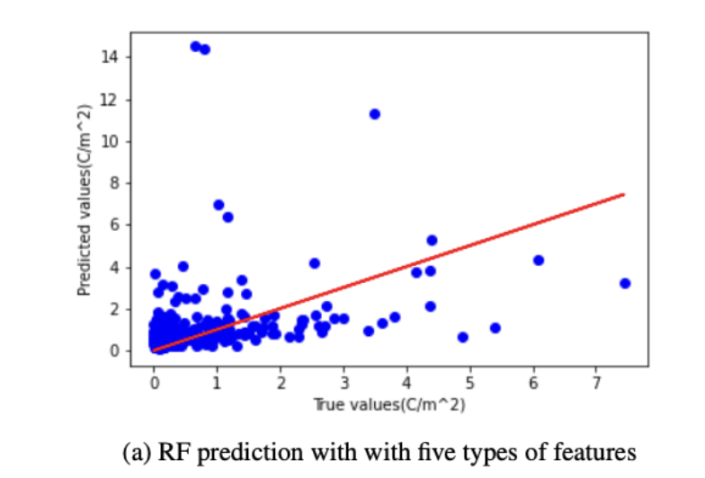

# **Piezo Modulus Prediction**

→ 34 citations  
→ [https://arxiv.org/abs/2111.05557](https://arxiv.org/abs/2111.05557)  
→ [https://github.com/jeffreyhusc/PiezoelectricML](https://github.com/jeffreyhusc/PiezoelectricML)

* Takes in various physical features of 1705 materials.

* Trains on **RandomForest** Regression  
  * 10-Fold CV.  
  * CV scores are reported as test results. Presumably because no hyperparameters are tuned.

* Number of trees \= 50 *(Unchanged)*  
    
* MAE used.

**Results:**

* RF performance is lacklustre, R squared is negative. 

> Amongst the 3 tested models, RF/SVM/GNN, RF performed the worst. However code for other models not available.

