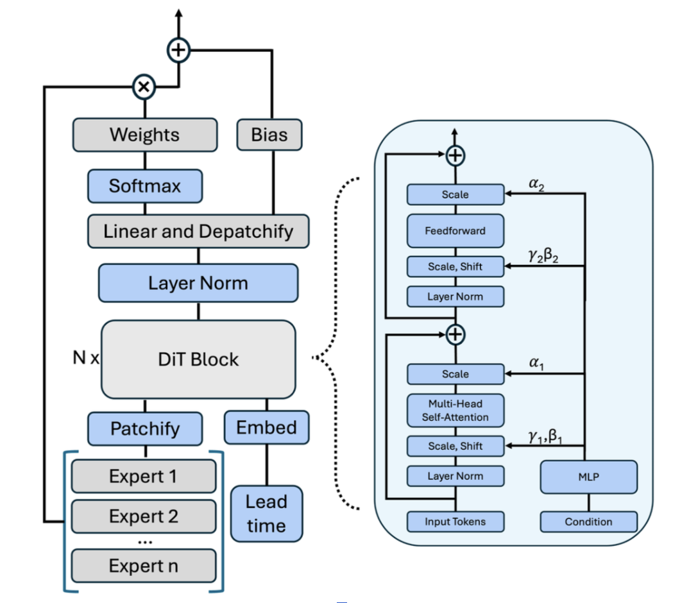
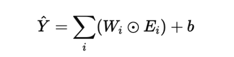

# Mixture of Weather Experts

**Code:** https://github.com/NVIDIA/physicsnemo/tree/main/examples/weather

***

### Scale / shift
&gamma;, &beta; are learnable parameters.  
&gamma; = Scaling factor (Default 1)  
&beta; = Bias/Shift (Default 0)  

### MLP
A normal feedforward neural network  
Takes in lead time as a condition, embedded into a vector [1,0,1] for eg.  

### Scale
Scales output of self-attention.  
Determines whether to trust attention output more, or Residue connection more.  

***

 

### Other Details

#### 1: Authors' Stated Objective of MOE
* Must outperform not just individual experts, but also a mean across experts.  

 

#### 2: Bias in Gating Mechanism 

* Bias allows for model to correct any mistakes that all experts share.  
* If all individual weather models predict 0.5C higher for an area, b will be -0.5.
