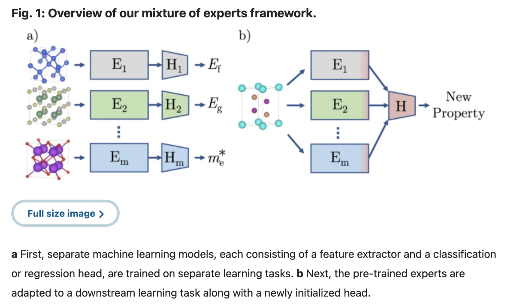
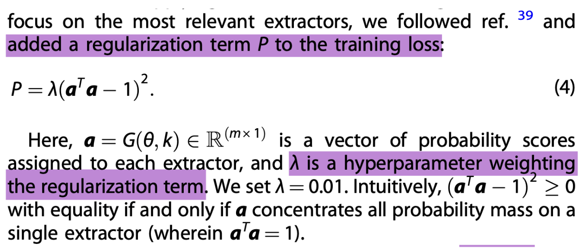

# **MOE In Materials Science**

→ [https://www.nature.com/articles/s41524-022-00929-x.pdf](https://www.nature.com/articles/s41524-022-00929-x.pdf)  
→ [https://github.com/rees-c/MoE](https://github.com/rees-c/MoE)  
→ Code does run  
→ No significant changes had to be made to get code to run

—--------—--------—--------—--------—--------—--------—--------—--------—--------—-----------  
  
→ Generally a standard MOE structure. k experts try to predict 1 property.

| Unique Feature 1 | k sparse probability vector → Only k experts are activated. `KeepTopK` k=3 → *(0, .5, .4, .1, 0, 0, 0, 0\)* → All other 5 experts have weight \= 0   What this means: For each *downstream task (i.e. Predicting a certain property)*, only k Experts will ever be used. The rest are completely ignored For a different downstream task, different Experts are used  |
| :---- | :---- |
| **Unique Feature 2** | G(x,,k)=G(,k) Meaning: **Output of experts *do not* affect gating logic**   |
| **Unique Feature 3** | All model (Expert) outputs are **added**, *not concatenated.* MOE output dimensionality is **independent** of no. of Experts |
| **Unique Feature 4** | Attempts to **concentrate Expert probabilities** in a handful of Experts.  is used. *The term below is **added to loss:*** (1,0,0,0,0) → P \= 0 (0.9,0,0,0.1,0) → P \= (0.92+0.12-1)2=(0.82-1)2   |
| **Unique Feature 5** | Experts are **pre-trained** in their own **data-abundant** tasks During MOE training, Expert model is kept constant, only last layer is **Fine-Tuned.**  A new **head** is attached, initialised with **random** weights, to “Adapt” expert to a downstream task.  *Because downstream task requires outputs of different dimensions/type, a new head is needed, heads cannot be carried over from pre-training*  |
| **Unique Feature 6**  | Models were trained for 1000 epochs unless validation error did not improve for 500 epochs, in which case early stopping was applied.  Adam MSE Loss Cosine Annealing scheduler  NVIDIA Tesla V100 and A100 GPUs.  Each dataset’s regression labels were normalized by subtracting the mean and dividing by the standard deviation of labels in the training and validation sets. Last convolutional layer was updated with an initial learning rate of 5e-3. Head layers were updated with an initial learning rate of 1e-2.  |

 

**Findings**

| Finding 1 | MOE-18 & MOE-n, where 18\>n, were of similar performance |
| :---- | :---- |

