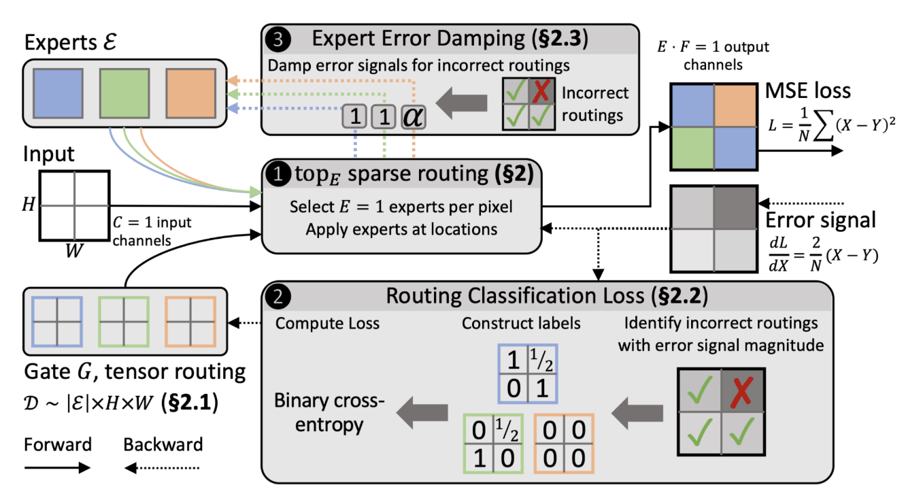
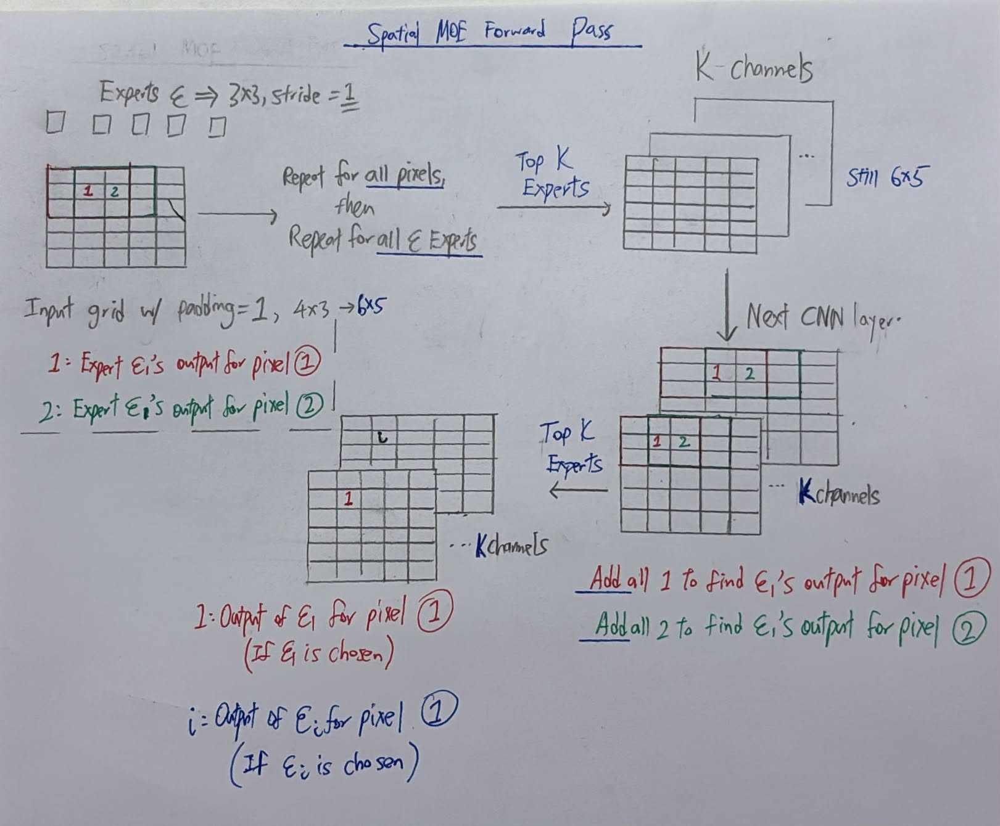
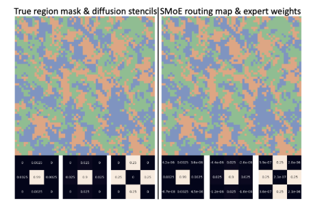

# **Spatial MOE**

**→** [https://arxiv.org/abs/2211.13491](https://arxiv.org/abs/2211.13491)  
→ [https://github.com/spcl/smoe](https://github.com/spcl/smoe)  
→ 25 citations   
—----------------—-------------—-------------—-------------—-------------—-------------—-----------  

 

\*\*\*

## General Feature 1

General Aim → To predict **Spatial problems**, such as weather forecasting

Input a grid, output a grid of exact same size (Dense Regression)

\*\*\*

## General Feature 2

**How is Dense Regression carried out?**

1. An **Expert is just a CNN 3x3 Conv slider**, with different weights in slide.  
2. Each layer slides **all n Experts across entire grid** (Dense Experts).    
   1. *Pixel at position (2,2): The layer would slide all n 3x3 experts, where each experts looks at (1,1), (1,2), (1,3), (2,1), (2,2), (2,3), (3,1) , (3,2) , (3,3)*  
   2. *If more than **1 channel**, each expert is applied across all channels, and sums across all channels, returning a **single number.***  
   3. *In paper, there is only 1 such Expert layer. Can add more if uw.*  
   4. *Experts across layer are independent*  
        
3. At each pixel, top K experts chosen  
   1. ***If K\>1, each Expert maps to 1 channel.**“The outputs of each expert at a point are **concatenated** (Not added\!) to form the output channel dimension (of size E·F )”*  
   2. *Multiple channels will be reduced by to **1 for each Expert**  in the next layer, as a convolution by each Expert at a 3x3 would **sum across all K channels***  
   3. *Hence, **number of channels always follows value of K.***    
   4. *If K==5, channels \== 5*

4. → Activation Functions → Output

\*\*\*

## General Feature 3

16GB V100 GPUs, 30k GPU hours total  
 

## General Feature 4

“We use a batch size of 64, the Adam optimizer with an initial learning rate of of 0.001, which we divide by a factor of 10 if the validation loss has not improved for two epochs to a minimum learning rate of 1e-6, and early stopping if the validation loss does not improve for five epochs”  
\*\*\*  
## Gating Mechanism 1

Gate is **not updated by Backprop** from MSE, instead from **RC Loss**

1. After main backward pass, each Gate looks at loss  reaching each selected Expert.

2. If loss exceeds a **quantile q compared to other gates***(This is a **hyperparameter** that can be set, shd be worst 70%)* of loss  , output of selected Expert is deemed **incorrect**. Target is set to **0**.

3. All other **unselected** Experts have Target set to N/E. Unselected means neither correct nor wrong. 1Target\>0  
   1. *N \= Number of incorrectly-chosen Experts*  
   2. *E \= Number of unselected Experts*

4. Weight for each Expert is updated by **BCE** loss, of value against Target

5. This is done **independently** for each pixel of grid map.

\*\*\*

## Gating Mechanism 2

**k sparse probability vector** → Only k Experts are activated. `KeepTopK`  
k=3 → *(0, .5, .4, .1, 0, 0, 0, 0\)* → All other 5 experts have weight \= 0  
   
**What this means**: For each *downstream task (i.e. Predicting a certain property)*, only k Experts will ever be used. The rest are completely ignored  
\*\*\*

## Gating Mechanism 3

Routing logic is **unaffected by inputs**. *“Tensor Routing”*

Useful because geographic locations are fixed. Experts do not need to look at inputs to decide, its own location suffices.  
\*\*\*

## Expert Feature 1

Experts updated by MSE, through **Backprop**.

1. MSE at all points of grid are summed   
   1. Note: Some points have 0 MSE as Experts were not selected there  
2. Error divided by N, total no. of grid points. This averaged error is used for Backprop

**Implication**: If **Expert chosen less, gradient update is of smaller magnitude**  
\*\*\*

## Expert Feature 2

**Expert Error Damping (0.1)**

* If a selected Expert is judged to be **incorrect** at a point, its main loss *(Not RC Loss)* during backprop is reduced. 

* This **decreases weight updates** for said Expert’s **Dense Conv Weights** *(Aka updates the Expert, not the Gate weights)*, at that point, so it doesn’t force an Expert to learn something it will not be good at anyways. 

* Instead the **Gate will do the job of not choosing that Expert.**

\*\*\*

## Application 1

→ Applied SMoE to ResNet-based **weather prediction** 

* **Replaced certain Convolution layers with SMoE layers**. *(IN both, Grid Size is kept through `padding=1, Stride=1`)*

* Number of filters in replaced filter \= No. of Experts chosen (K). This ensures channel count at each layer remains the same. 

* Routing between layers with same Expert count & output Channel count share the same routing weights