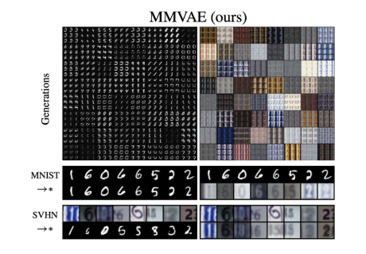
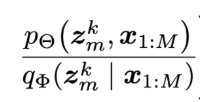
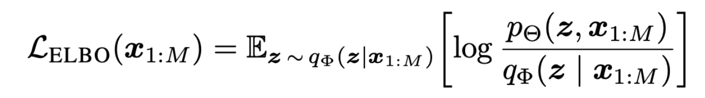
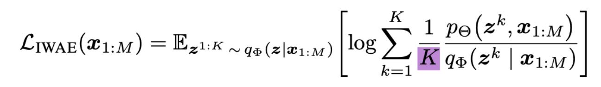
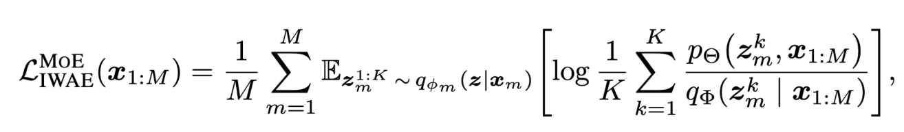

# **ImagexLangMOE**

*https://arxiv.org/abs/1911.03393*
*https://github.com/iffsid/mmvae*

*→ For examples’ purposes we take latent space to be 1D*  
*→ The code works here, no major changes needed*  
*→ 600+ citations*  
*→ However, not really regressive*

## Aim of Paper

Trains a multimodal model that achieves the 4 points:
- Latent factorisation
- Coherent joint generation - One point in latent space leads to similar outputs across modalities 
- Coherent cross generation - Input in modality x creates output in modality y
- Synergy - Training different modalities together creates complementary effects

During training, all modalities are required (bundled together) as input

During inference, not all modalities required, but output can be of any modality (This is one of the innovations of this paper)

Latent space is n-dimensions, shared between all modalities. This means that encoder outputs across modalities map onto the same n-dim latent space

# **Training Flow:**

*We take MNIST \+ SVHN as an example:*  
*(Another example here is CUB image-captions, where its text \+ image)*  

1. Data across modalities are bundled together during DataLoader  
   1.  dataT\[0\] \= MNIST, dataT\[1\] \= SVHN  
2. In main.py, we run training loop  
   1. Through *argparser*, we set *MNIST as **anchor modality**. This means only MNIST encoder is run.*  
3. *Vae\_mnist.py & vae.py* only looks at MNIST image, **not SVHN image**. A latent cloud exclusively produced by MNIST modality is generated.  
4. **K** points in latent space cloud are picked.  
   1. *qz\_x is the cloud*  
   2. *`rsample` grabs K points in cloud*  

5. All K Latent space points are fed into **Decoders of both MNIST & SVHN**. 2K images are outputted.  
   1. *We have **K** values for denominator, as there **K** points in latent space chosen, giving us **K** values for probability density function.*  
      1. *We take denominator to be **KL divergence,** numerator to be **Recon loss***  
   2. ***‘Recon loss’** for each pair of 2 images is generated → ‘Recon loss’ of each pair is added together → **K** values for **numerator***  
   3. *This gives us **K** different values for fraction below*

   

6. We calculate the **average** *(1/K)* for the K values of the **MNIST anchor**. We then apply **log** on this value.  
   1. *Repeat steps 2a-5 for **SVHN/Other modalities as anchor.***   
   2. *Applying log before step 7, instead of before, is called the ‘**looser**’ lower bound, which is proven to be better in this paper*  
        
7. Now we have 2 *logged* average values. They are **averaged**, since each modality has a weightage of **1/M.** We obtain a **single loss value.**   
   1. *Calculating **1/K average** for each modality separately is what allows us to implement MMVAE loss, where latent clouds **arent mixed**, and have **equal weightage of 1/M**.*   
        
8. This loss is used to update Encoder & Decoder of both MNIST & SVHN by **backprop**  
   1. Loss type is chosen in `objectives.py`. `def iwae` used here.   
        
9. During *inference* time, not all modalities have to be present → **Min 1** needed for a latent space representation

 
 
 
## **ELBO Loss function:**  

 
 
 
## **IWAE Loss (Upgrade)**

Each pass, K samples are taken from the blended cloud (Of all modalities), instead of 1\. K samples are fed individually into decoder. Losses are averaged.
 
 
 
## **Looser MMVAE Objective (Upgrade)**

* Instead of sampling from the expected of all latent clouds, **we don't mix the clouds**.  
* Instead we sample K times from **each modality's cloud**, and give them **1/M** weightage in the loss.  
* Ensures no modalities can *overpower* others. *“Weighing of gradients of samples from different modalities equally”*

 
 
 
## Misc. Info
**MNIST**: Didn't use CNN, only used FC  

**CUB**: Input is not pure image. Its pre-extracted CNN features, from a pretrained CNN such as ResNet. Decoder output is the same 2048\.

**CUB-language:** Each word become 256d. If 10 words, total 2560d. Subsequent CNN layers treat them as 1D image.  

