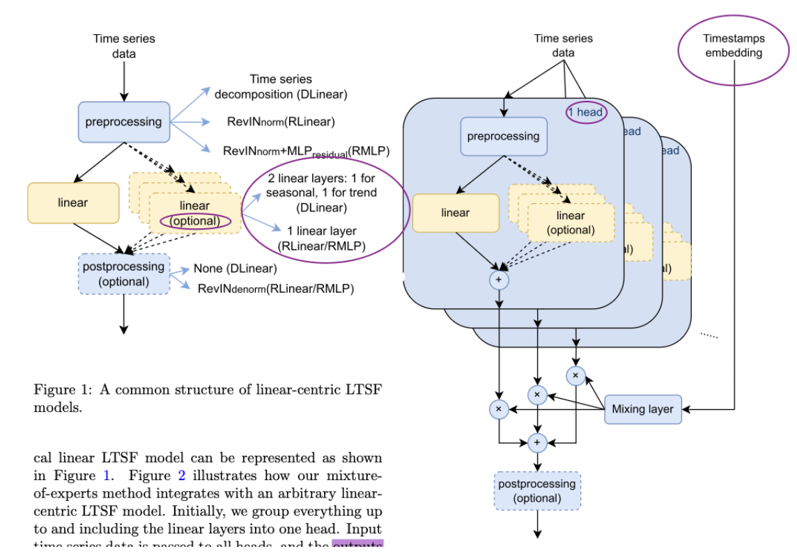
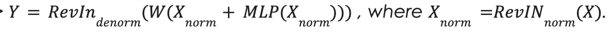
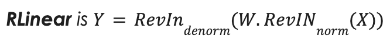
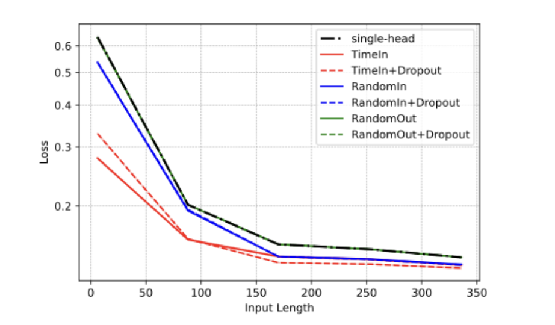
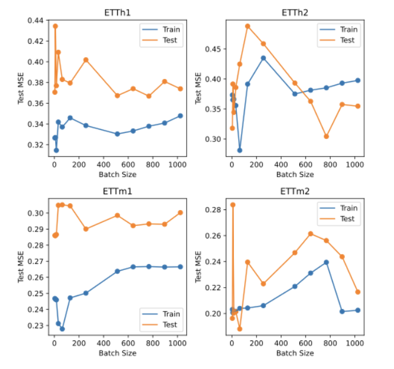

# **Mixture of Linear Experts**

  

→ <https://arxiv.org/abs/2312.06786>

→ <https://github.com/RogerNi/MoLE>

→ 86 citations 

  

  
  

**Aim & Structure** 

  

> Paper nomenclature: Each ***‘Head’*** means Expert. 

> Image nomenclature: “Linear” Means Expert.
  

**Aim**: To create fidelity for **Linear Models** in **long-term time series forecasting**, using MOE. Weather, Traffic, Electricity, etc.

  

**Forward pass:**

1.  `[Batch, seq_len, Channel]` as input X  
2.  `[Batch, seq_len, features]` as calendar features `(x_mark)`, on a *separate, parallel path*.

  

> `seq_len` = 1 time-step

> `Batch` = Batch-size by `DataLoader`. Without this, input would be `[seq_len, Channel]`. There is only one datapoint *(EG. Speed)* at each `seq_len`. We split up input by every `Batch`. 

>> *EG. We take* `Channel`*=1,* *\[(1,2,3,4,5,6,7,8)\]* *→* *\[(1,2,3,4), (5,6,7,8)\]* *for* *Batch**=4*

 

> `Channel` = Different variables, that are all forecasted together. 

>> *EG. weather dataset's 21 meteorological variables - Rainfall/Temp/etc.*

   

> Calender feature/`x_mark` = Features for each set of `[Batch, seq_len]` , describing temporal conditions of every point of data. 

>>  EG. *“Weekend/Weekday”, “Holiday”*, etc.

>> “...various temporal components of a datetime value are encoded into uniformly spaced values between `[−0.5,0.5]`”

  
  

3. Converts input into moving average. *(****DLinear*** *only)* 
      
    1.  Moving average becomes → **Trend** (X_trend)
    2.  Original - Moving Average → **Seasonal**  (X_Seasonal)

  

> *This decomposition captures time-dependent anomalies, that an overall trend does not predict. So 2 processes will deal with it better.* 

> *There is no decomposition for* ***RLinear & RMLP*** *(Elaboration at bottom).*

  

4. `x_mark` is used to generate weights for each Expert, through 2 MLP layers. Reason is that timing will affect when each Expert is useful. `t_dim` experts.
      
    1.  Model takes temporal characteristics **of first entry in batch**: `x_mark[:, 0]` → Weights for all Experts generated for that 1 batch. 
    2.  Weights in different channels, for each Batch is independent.

  

> *This means different batches, in the same channel have* ***different weights****.*

> *This means weights in different channels are completely* ***different****.*

> *However, Experts are shared.*

> *Authors tried* ***Weight dropout*** *as regularisation (0.2).*  

  

5.  Y= W_trend X_trend + W_seasonal X_Seasonal

More rigorously, 
- `M` = 2x MLP
- `H_i` = Expert Weights 
- `X` = Input 
- `W_i, Y_i` = Weight of Experts and Product of Expert with `X` respectively.

> All Experts are contained in a **single** **weight matrix**. The Experts are literally just a bunch of weights, *no bias.* 

  
  

6.  Output = Predict `[Batch, pred_len, Channel]` Note that `Channel` remains, each input variable gets its own corresponding output.

  

7.  **MSE Error** used for Y vs Y_hat

8. Backward pass flows through both Mixing layer & Experts, down both the `X` & `X_mark` paths. Weights in both Mixing 2xMLP & Experts are updated by gradient descent.

 
 

## General Feature 1

  - Input is decomposed into Trend & Seasonal in **DLinear** architecture

  - Not done so in RLinear & RMLP

 

>> *Denorm is reverse of normalisation.* 

>> *RLinear has trainable parameters & Denorm uses* ***same parameters*** *as Norm* 

   

> ***RMLP*** *incorporates an additional 2-layer MLP to the base RLinear mode*

>> *Performs better on* ***larger datasets***

 

## Gating Feature 1

- Gradient descent updates 2xMLP weights (In Mixing layer)

## Gating Feature 2

  - All experts run during runtime. 
  - Not top-K, its **dense** → All Experts get a (Softmaxed) Weight.

  

## Gating Feature 3

  - Random expert **dropout** during training, where weight set to 0. Not used during inference. 
  - Probability for this can be set as a **hyperparameter.** 

  

## Gating Feature 4

  - Weights are channel specific. **Each batch in each channel** has weights’ sum set to 1. 

> *Meaning Expert* ***routing for different channels & batches are independent****, but the same* ***Experts are shared across channels and batches***  

   

## Expert Feature 1

- Gradient descent updates Expert weights

## Expert Feature 2

  - Each Expert is linear `nn.Linear(seq_len, pred_len)` with no activation.
      
      - They are just weights, no bias

  
   

## Findings 1

  - Regarding usefulness of `x_mark` / Calendar Feature: It is more **useful when input sequence length** **Batch** **decreases** (Tested against random inputs for Calendar Feature)

 

> “... as the input sequence lengthens, the linear layer has more past data to consider, and some patterns in this data can hint at upcoming changes in the series. Hence, we predict that the effect of conditioning on start time should be less beneficial.”

## Findings 2

  - Batch-size Tuning: Mid-range of batch sizes exhibits poor generalization, with low training loss but high test loss. Small or large are better. 

