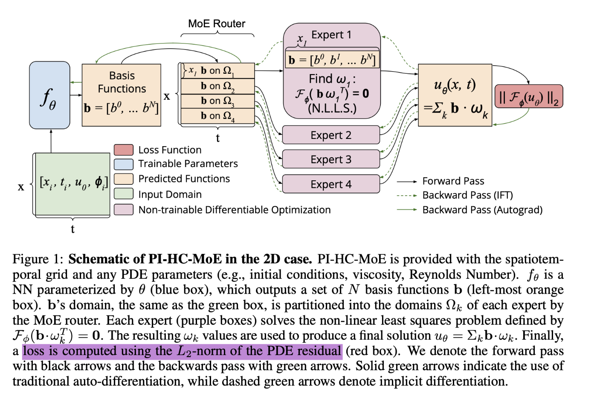
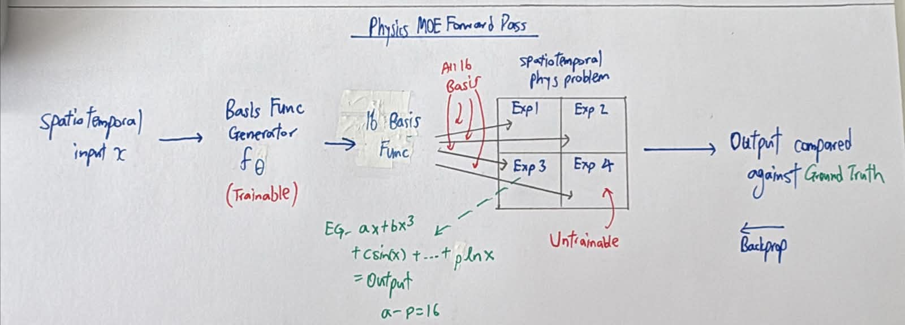
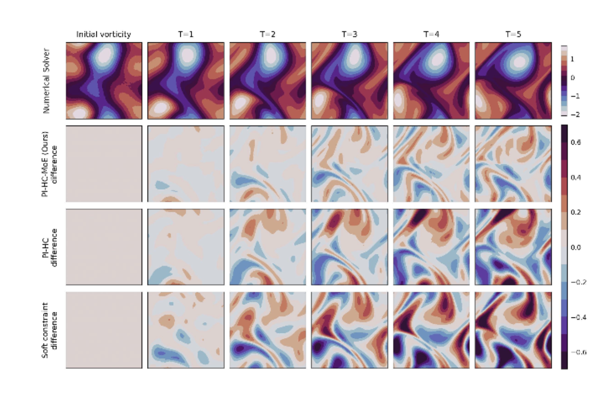
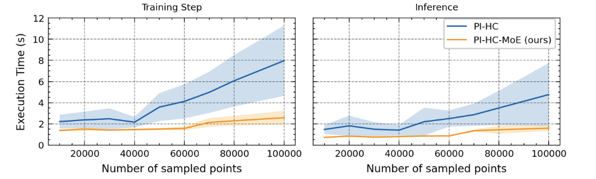

# **Physics MOE**

→ 42 citations

→ <https://github.com/ASK-Berkeley/physics-NNs-hard-constraints>

→ <https://arxiv.org/html/2402.13412v1>

## Architecture

 
 

## Output 

 

**Core idea of paper:**

1.  Grid is divided into smaller pieces
    1.  To model physical phenomena, **large areas = Different dynamics at each area** = Different Experts better at each point
    2.  Can compute in **parallel** → Faster

1.  MOE can integrate **physical constraints** into physical ML models better than **soft/hard constraints** 
    1.  Physical constraints are like *conservation of mass/energy* → Equations for output to follow. 
    2.  Physical constraints can be **soft or hard constraints.**
    3.  **Soft** constraints introduce penalty term for outputs deviating from physical equations, which **can be violated** if penalty isn't strict.
    4.  **Hard** constraints are stricter but may create very **turbulent** training, as you are fitting entire grid onto a single equation. 

1.  Possible to use original equations, but they may eat high amts of computational power, esp if you want to simulate multiple times

 

## **General Feature 1**

Inputs are **spatiotemporal**. Property at (Space, Time) is fed in

## **General Feature 2**

Forward Pass is drawn.  **What is**  **f(****)****?**\> Has a function at front of network, f() to generate basis functions. \> Takes **basis functions** *(Random init)* & finds coefficients of each. Let f(x) be ground truth, f1(x),  f2(x) be basis functions. f(x)= af1(x)+bf2(x).\>\> Basis functions are like basis vectors (Independent) in IA Maths; You use them *(with different coefficients)* to build a more complex expression x2, sin(x), logx, etc  \> All **Experts share the basis functions**: They aim to find **correct coefficients for each basis function** in their own patch of space 

## **General Feature 3**

A100

## **General Feature 4**

4 Experts, 16 basis functions used in test

 

## **Expert Feature 1**

The grid is split into smaller pieces *(Reason stated above)* Each **Expert is an expert of that piece only**. Unlike normal Experts, it only aims to find correct coefficients of basis functions *(Explained below)* 

## **Expert Feature 2**

All **Experts share the basis functions** \> Basis functions are **updated in training,** but not directly. **\> Weights of** f() are updated each backprop → Outputted basis functions are changed each forward pass.\>\> Infact the only place in model with parameters to train is f().

## **Expert Feature 3**

Each **Expert does not have to be trained at all**; an answer is already given. They are updated, to *adapt to the new basis functions, but not trained.*  *\> Uses “iterative non-linear least squares solver, Levenberg-Marquardt”* \> Also note that backward pass still flows through Experts, just not updated.

 

## **Finding 1**

  - Soft constraint completely fails
  - Hard constraints performs ok
  - MOE performs best, and also is the most scalable

