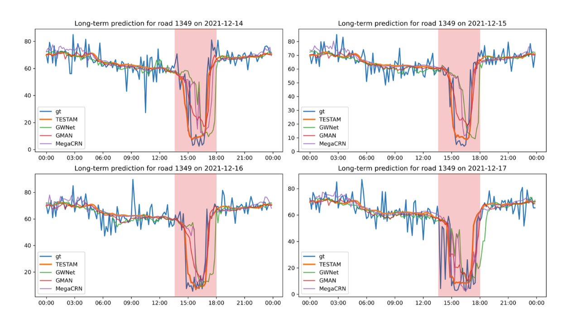
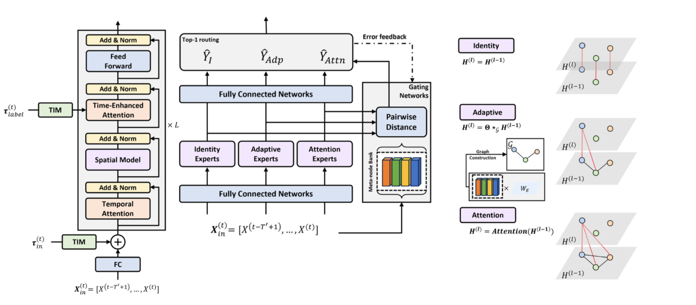

# Traffic MOE

[source: 2] https://arxiv.org/abs/2403.02600
[source: 3] https://github.com/HyunWookL/TESTAM

[source: 4] → Cited by 76

## General Feature 1
Tries to predict  traffic speed of a road for next 12h , using speed of past hour. 
> 3 Experts used,  each of a very different architecture  

## General Feature 2
How is Forward Pass carried out?
> Memory :  20 Learnable reference patterns  in a “latent space”, representing various traffic conditions.
> Used to determine weights for Gating logic
Input  raw  traffic data is fed
1st path:  Goes into FCC + Experts
2nd path:  Goes into Memory (“Meta-node Bank”) 
1st path  generates Expert Hidden Layer as output → Fed into “Expert Reformer” layer.
> This reforms Expert Hidden Layer output into same “latent space” as Memory
>  Self-attention .
2nd path  reforms input into “Input Reformer” layer.
>  Cross-attention  between input & Memory.
Self-attention output compared to Cross-attention output. Weight for each Expert determined by the  Cosine Similarity .
Top-1 Expert selected → FF layers → Output speed predictions

## General Feature 3
RTX 3090GPU

## Gating Feature 1
KeepTopK  = 1
> Only one Expert chosen from 3.

## Gating Feature 2
Uses  Pseudo-Labels . Lets use an example:
Gate  Updating logic:  (No backward pass)
"Experts predict [50, 55, 80], truth = 60"
"This prediction is the output of FCN, after each Expert."
"Gate predicts [ 0.6 ,  0.3 , 0.1]"
"Selects Experts by comparing an  attention summary  of Expert’s  hidden layer  output to its own  memory  of scenarios ,  where hidden layer output =  output before FCN . "
Called  “Pairwise Distance”  
"Errors = [10, 5, 20] →  gate[2]  is the worst choice."
"best_choice  = [0, 1, 0]  Pseudolabel"
"worst_avoidance  = [1,0,0]  Pseudolabel "
"If Gate picked the worst (0.1) instead,  worst_avoidance   is spread across all non-worst Experts"
"best_choice  = −0.5 · log( 0.3 ) → pushing  gate[1]   up."
"worst_avoidance  = −0.5 · log( 0.6 ) → pushing  gate[0]  up, implicitly away from worst."
Result : Gate makes worst Expert less & less likely to be chosen, as  weight assigned to non-worst Experts keep increasing.
Expert  Updating logic:
Compare Expert output against Ground truth
Apply  backward pass
Weights inside Experts are updated

## Gating Feature 3
Above was oversimplification: There is no dedicated Gating Layer.  Gating is done in Memory .
"Pseudolabels used to update “Input Reformer”, “Expert Reformer” & Memories themselves "
"Backprop gradient directly updates Memories too → Unrelated to Gating logic, as 1 Expert uses Memories to help with its own output "

## Expert Feature 1
Warm-up  logic
"For first  warmup_epoch  epochs,  only Experts are updated ."
"Gates’ routing logic is not updated . This allows for Experts to learn first, preventing instant sidelining of Experts. "
